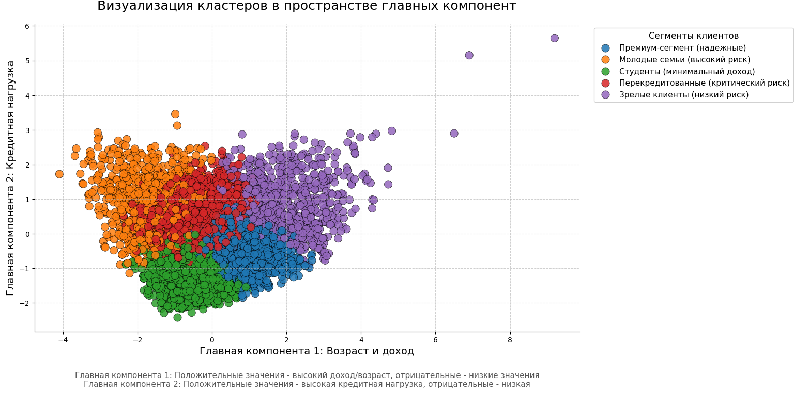

## Проект: Скоринговая модель дефолта >60 дней (Тестовое задание)

### Описание

В этом репозитории представлено решение тестового задания по разработке алгоритма скоринга клиентов банка для прогнозирования дефолта (>60 дней просрочки) и сегментации заемщиков. Задачи включали:

1. Анализ и сегментация обучающей выборки
2. Построение и сравнение скоринговых моделей
3. Оценка эффективности моделей
4. Разработка стратегии принятия решений

---

## Структура проекта

```
credit_scoring/
├─ model_gbm.py
├─ model_lr.py
├─ model_rf_BEST.py
├─ model_svm.py
├─ model_xgb.py
└─ RF+GBM.py

data/
└─ data_previous.xls

imgs/
├─ segmentation_visual.png   ← сегментация заемщиков
├─ lr_metrics_roc.png        ← ROC + метрики для LR
├─ rf_metrics_roc.png        ← ROC + метрики для RF (best model)
├─ gbm_metrics_roc.png       ← ROC + метрики для GBM
├─ svm_metrics_roc.png       ← ROC + метрики для SVM
├─ xgb_metrics_roc.png       ← ROC + метрики для XGB
└─ RF+GBM_roc_pr.png          ← ROC/PR для стеккейна

results/
├─ results_lr.csv
├─ results_rf_BEST_MODEL.csv
├─ results_gbm.csv
├─ results_svm.csv
├─ results_xgb.csv
├─ results_RF+GBM.csv
└─ segmented_clients.xlsx

segmentation/
└─ segmentation.py
```

В папке credit_scoring вы сможете найти разработанные мною модели, которые предсказывают значение таргета (предсказание дефолта), а также высчитают его вероятность
В папке data находится изначальный датасет
В папке imgs вы сможете найти изображения метрик, которые я продублировал в этом документе, а также визуальное сегментирование клиентов на 5 кластеров.
В папке results вы сможете найти результирующий датасет от каждой модели, которая предсказала таргеты на тестовой выборке
В папке segmentation находится файл, код которого запускает сегментацию клиентов 
---

## 1. Анализ и сегментация заемщиков

Выполнена кластеризация клиентов на основе демографических и финансовых признаков:

* Метод: K-Prototypes (смешанные данные)
* Предобработка: стандартизация числовых признаков, one-hot для категориальных



**Получившиеся профили кластеров:**


| Кластер                             | Доля дефолтов   | Размер     | Возрастная группа  | Доходная группа    | Медианный доход |
| ----------------------------------- | --------------- | ---------- | ------------------ | ------------------ | --------------  | 
| Зрелые клиенты (низкий риск)        | 19.8%           | 787        | 36-45              | Средний            | 22,000          |
| Молодые семьи (высокий риск)        | 23.7%           | 827        | 45+                | Низкий             | 9,000           |
| Перекредитованные (критический риск)| 15.9%           | 1643       | 45+                | Низкий             | 12,000          |
| Премиум-сегмент (надежные)          | 23.3%           | 1413       | 26-35              | Средний            | 16,000          |
| Студенты (минимальный доход)        | 20.2%           | 1340       | 26-35              | Низкий             | 10,000          |

---

## 2. Скоринговые модели

Для прогнозирования дефолта (>60 дней) были реализованы следующие алгоритмы с метриками на отложенной (50%) части данных:

### 2.1 Logistic Regression + WOE-биннинг

* AUC: 0.600
* Accuracy: 0.414
* Precision: 0.234
* Recall: 0.838
* F1-score: 0.366


### 2.2 Random Forest (оптимизированный)

* AUC: 0.628
* Accuracy: 0.524
* Precision: 0.259
* Recall: 0.728
* F1-score: 0.382
* Gini: 0.256


### 2.3 LightGBM (GBM)

* AUC: 0.614
* Accuracy: 0.609
* Precision: 0.274
* Recall: 0.569
* F1-score: 0.370


### 2.4 SVM

* AUC: 0.602
* Accuracy: 0.441
* Precision: 0.237
* Recall: 0.797
* F1-score: 0.365


### 2.5 XGBoost

* AUC: 0.609
* Accuracy: 0.570
* Precision: 0.263
* Recall: 0.626
* F1-score: 0.370


### 2.6 Стеккейнинг (Random Forest + GBM)

* AUC: 0.578
* Accuracy: 0.746
* Precision: 0.280
* Recall: 0.165
* F1-score: 0.208
* Avg Precision (PR AUC): 0.256
* Brier Score: 0.184


### Помните, что модели не запустятся без окружения, поэтому сначала нужно будет установить зависимости: 

---

## 3. Оценка эффективности моделей

Для сравнения моделей использовались метрики:

* **ROC AUC** показывает способность различать классы.
* **Precision/Recall/F1-score** отражают точность и полноту прогноза.

| Модель              | AUC   | Precision | Recall | F1    |
| ------------------- | ----- | --------- | ------ | ----- |
| Logistic Regression | 0.600 | 0.234     | 0.838  | 0.366 |
| Random Forest       | 0.628 | 0.259     | 0.728  | 0.382 |
| LightGBM            | 0.614 | 0.274     | 0.569  | 0.370 |
| SVM                 | 0.602 | 0.237     | 0.797  | 0.365 |
| XGBoost             | 0.609 | 0.263     | 0.626  | 0.370 |
| Стеккейнинг RF+GBM  | 0.578 | 0.280     | 0.165  | 0.208 |

Также для лучшей модели была посчитана метрика Gini (0.256): 

---

## 4. Стратегия принятия решений (СПР)

Ниже представлена рекомендованная бизнес-логика обработки кредитных заявок с использованием скоринга и доп. методов анализа.

### 4.1 Сбор и верификация данных

1. **Сбор анкеты**:

   * Клиент заполняет персональные, финансовые и контактные данные.
2. **Верификация**:

   * Автоматическая проверка корректности формата данных.
   * Сверка контактов через SMS/email для подтверждения.
   * Проверка на дубликаты заявок.

### 4.2 Скоринг и скоринговый балл

1. **Применение модели**:

   * Рассчитать вероятности дефолта и скоринговый балл.
2. **Классификация по уровням риска**:

   * **< 0.20** — низкий риск: автоматическое одобрение.
   * **0.20 – 0.50** — средний риск: дополнительная экспертиза.
   * **> 0.50** — высокий риск: требуется ручной андеррайтинг.

### 4.3 Андеррайтинг

Для средних и высоких рисков:

* Углубленное изучение доходов, источников средств.
* Запрос подтверждающих документов (справки, выписки).
* Проведение интервью с клиентом (при необходимости).

### 4.4 Проверка в Бюро Кредитных историй (БКИ)

* Автоматический запрос кредитной истории.
* Оценка наличия просрочек, других открытых обязательств.
* Учёт скоринга БКИ как дополнительного фактора.

### 4.5 Проверка по черным спискам

* Сверка ФИО/паспортных данных по внутренним и внешним черным спискам.
* Автоматическая блокировка заявок при попадании.

### 4.6 Принятие решения и уведомление

1. **Автоматическое одобрение** — для низкого риска.
2. **Ручное рассмотрение** — для средний/высокий риск.
3. **Отказ** — при риске «очень высокий» (>0.75) или при наличии черных списков.
4. **Уведомление клиента** — через SMS, email с указанием решения и дальнейших шагов.
